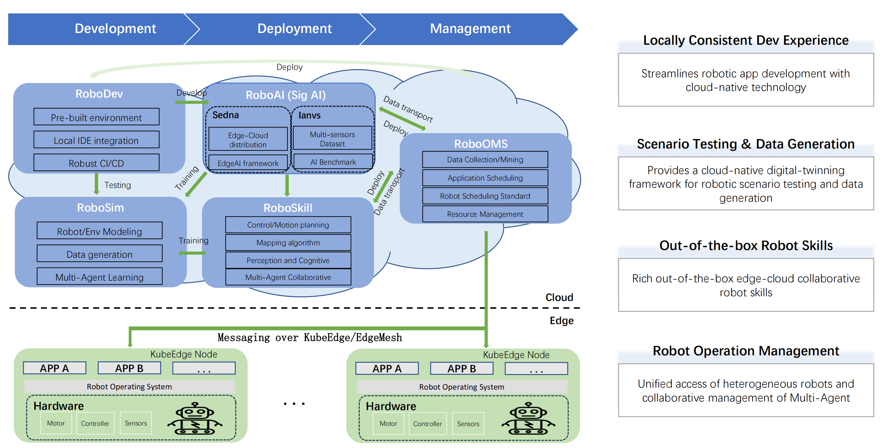

# KubeRobo

## Motivation
KubeRobo will systematically demonstrate [KubeEdge SIG Robotics](https://github.com/kubeedge/community/tree/master/sig-robotics) end-to-end cloud-native robotics solution. It will serve as a comprehensive guide to all open source projects under the SIG Robotics umbrella, covering their scope, roadmap, and feature plans.

## Scope
**What kuberobo will do:** Here is the sandbox of KubeEdge SIG Robotics, or a bird's-eye view. You can quickly understand the work plan of KubeEdge SIG Robotics and the roadmap of each project (the roadmap of each project will be supplemented with additional materials later).

**What kuberobo won't do:** We won't host any projects code here, but will make a link to each project. You can think of kuberobo as a solution guide or catalog.

## Concept

**Development Experience Challenges**
- Complex Environment Integration
- Costly Development and Testing
- Limited Self-Service Delivery

**Replicable Robotics Solution Acquisition**
- Establishing Unified/Universal Robot Skills
- Embracing Robotics Skill Marketplaces
- Balancing Edge-Cloud Resources

**Robotics Operation Management Limitations**
- Heterogeneous device management
- Heterogeneous Data Collection and Security
- Resource Allocation and Optimization
- Unreliable Robot-Edge-Cloud Communication

**Constraints in Robotic Artificial Intelligence**
- Insufficient Multi-Model Datasets
- Resource vs. AI Contradiction
- Inability for Continuous Optimization and Catastrophic Forgetting

## Projects

**RoboDev: A consistent development experience on the cloud and edge provides developers with Efficient cloud native development tools**

- RoboDev provides developers with a consistent development experience on the device and cloud, enabling fast and flexible robot application development.

**RoboSim: Multimodal data generation, distributed simulation, large scenarios
Loading, providing scenario testing and data generation for robots**

- RoboSim(Robot Simulation) simulates and verifies robot capabilities based on customer-defined scenarios.

**RoboSkill: Out-of-the-box edge-cloud collaborative robot skills**

- RoboSkill researches and develops robot applications to empower robots with intelligent movement, perception, decision-making, and execution.

**RoboOMS: Unified access to heterogeneous robots and Muti-Agent collaboration
management**

- RoboOMS(Robot Operation Management Service) centrally manages multi-brand heterogeneous robots, supporting robot motion planning, control, and monitoring operation and maintenance.

- Based on KubeEdge. [KubeEdge](https://github.com/kubeedge/kubeedge) and its ecological components, such as [EdgeMesh](https://github.com/kubeedge/edgemesh), serve as the technical base for a device-edge-cloud integrated robot solution, managing node equipment, orchestrating applications, network communications, and AI plugins.

- Driving Multi-Robot Scheduling with Unified Data Interface Standard, [link](https://github.com/kubeedge/community/issues/187).

**RoboAI：Edge cloud collaborative robot AI operation and testing framework**
- KubeEdge AI ecological projects, such as [Sedna](https://github.com/kubeedge/sedna), [Ianvs](https://github.com/kubeedge/ianvs)
- The strong fitting ability of LLM(Large Language Models) enables humanoid robots to achieve higher accuracy in tasks such as target recognition, obstacle avoidance, three-dimensional reconstruction, and semantic segmentation.
